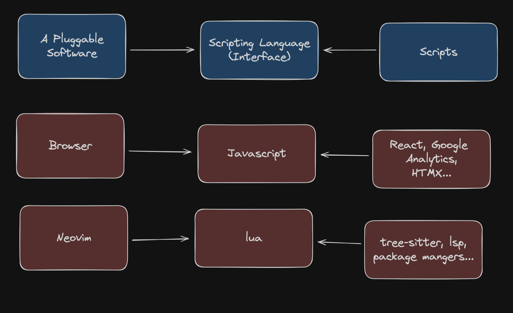

> Photo by
> [Techivation](https://unsplash.com/@techivation?utm_content=creditCopyText&utm_medium=referral&utm_source=unsplash)
> on
> [Unsplash](https://unsplash.com/photos/a-laptop-computer-sitting-on-top-of-a-wooden-desk-3KO5_x6FfJM?utm_content=creditCopyText&utm_medium=referral&utm_source=unsplash)

---

I don't get why people want to use WASM if they don't plan to run it
in a browser.

I mean, I do get it, I'm just not sure it's the right choice. As far
as I understand, people use WASM as a new standard for writing plugins
for tools.

## WASM is yet another scripting language

Historically, if you wanted to create a pluggable system, you would
choose a high level language. For example, neovim
uses [lua](https://www.lua.org/) for making neovim do things it doesn't
have baked in. Things like syntax highlighting,
[lsp](https://microsoft.github.io/language-server-protocol/) integration,
and keybinding configuration are all set using lua. You write you own
scripts and use existing plugins you find online or even buy.

Another important example is Javascript, which is, at least historically,
a scripting language meant to add interactivity to HTML pages. It's a
high level programming language that allows you to write plugins, in the context
of running it by another specific program (the browser in our case).

Javascript is the reason that WASM was invented. People did and are doing
incredible things with JS and this created the rich and powerful ecosystem
around. Just looking at the size of Typescript, Webpack, JSX and similar
popular tools means a lot of people want more that what JS has to offer on
its own.

With the rise of these toolchains that generate javascript as output,
one has to wonder wht bother compiling our code to a high level, dynamically
typed language? The answer to that question is WASM!

WASM is a way for people who want to develop in practically any language they
choose (given a wasm compiler, of course), and run that in the browser.
You can bring your own toolchain, own implementation of data structures and
all the benefits of your programming language shipped to the browser.

> Shipping your languages runtime is a problem that arose from that. But that's
> not for this post

## But WASM is a weird scripting language

But for _some reason_ people are taking this new, low level language
specification and adding support for system calls. It's called
[WASI](https://wasi.dev/) (short for "WebAssembly System Interface"),
and it is used for running WASM code inside a process on an operating system.

But something doesn't add up to me.

Only Javascript is so successful that it justifies such a dramatic low level
interface for its built in scripting language.

The neovim team seems to be satisfied with lua, and so are many Redis users.

A lot of newer tools use javascript ([or a subset of it](https://jslib.k6.io/))
as the interface.

And a lot of ML engineers love python and keep adding it as a scripting language
as well.

## Don't use WASI unless you are super successful

My bottom line is that most plugins don't need the complexity and drawbacks
that come with using WASM. The only case that justifies this is the browser,
as it is the de-facto operating system for any GUI application. Running a
game engine inside a browser makes sense, and is possible with WASM.
But inside an IDE? A cli tool? not as much.

Usually, plugins can be written in single js/lua/python file, so why bother
with WASM?
